# 品質スコアリング ガイド

スクリプト: `scripts/score-project-quality.py`

## 全体像

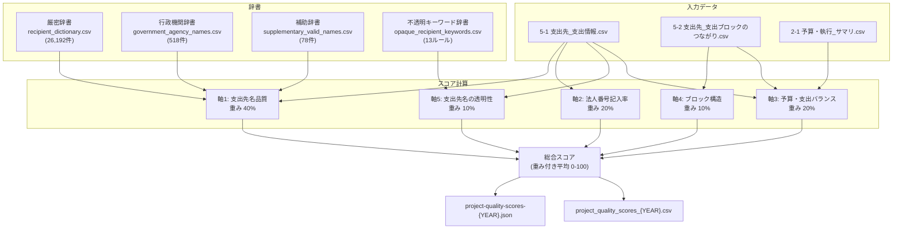

---

## データロード フロー

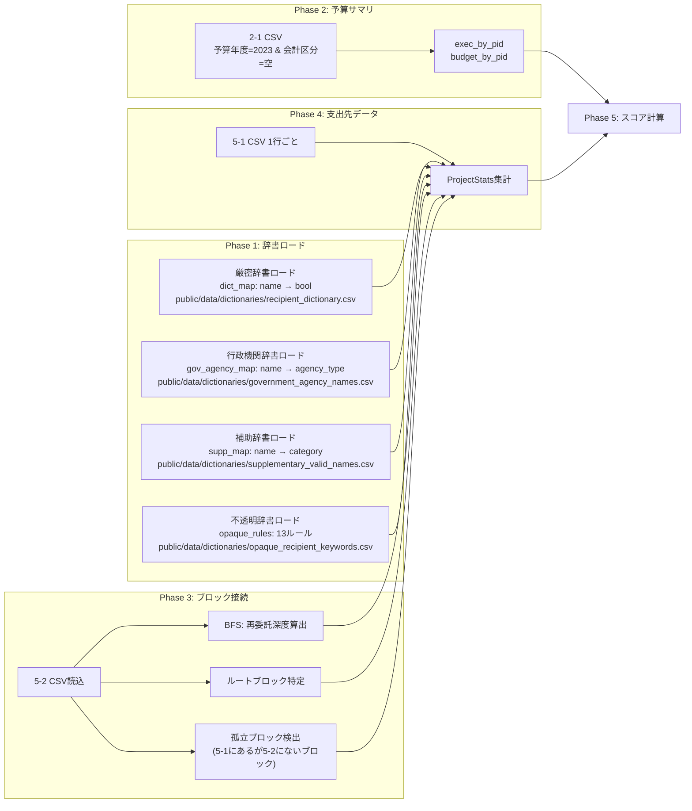

---

## 軸1: 支出先名品質（重み40%）

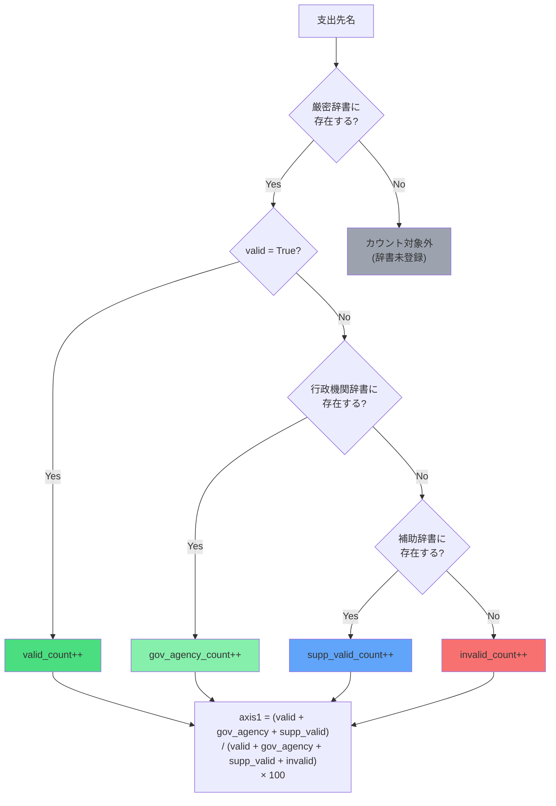

### 辞書の階層構造

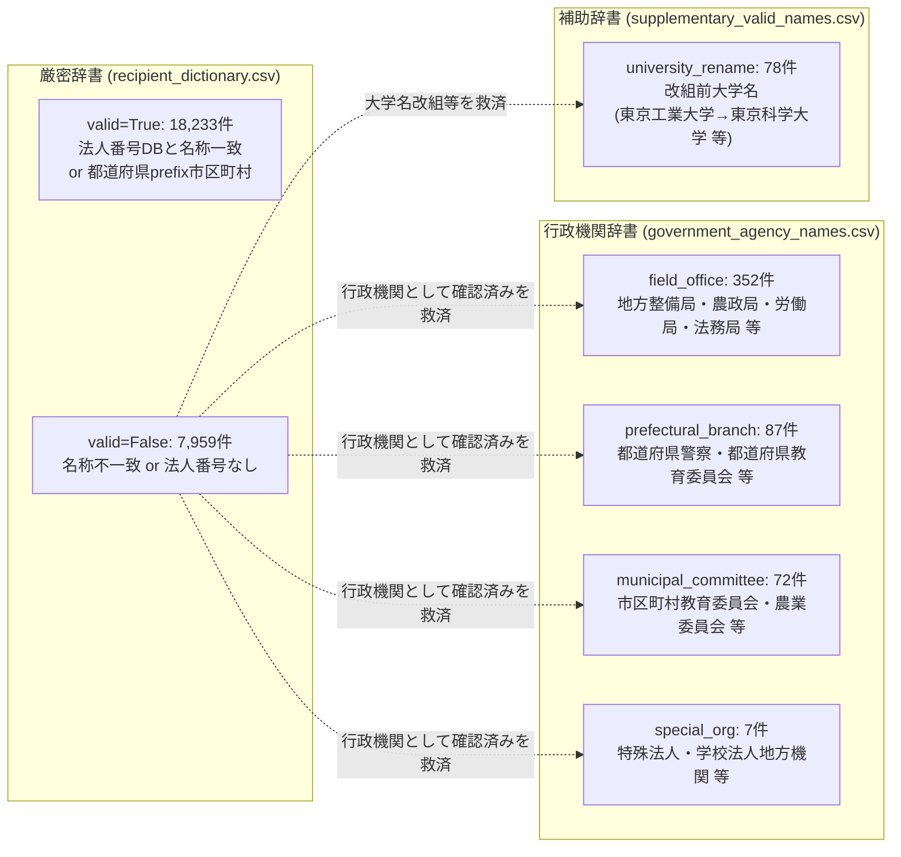

---

## 軸2: 法人番号記入率（重み20%）

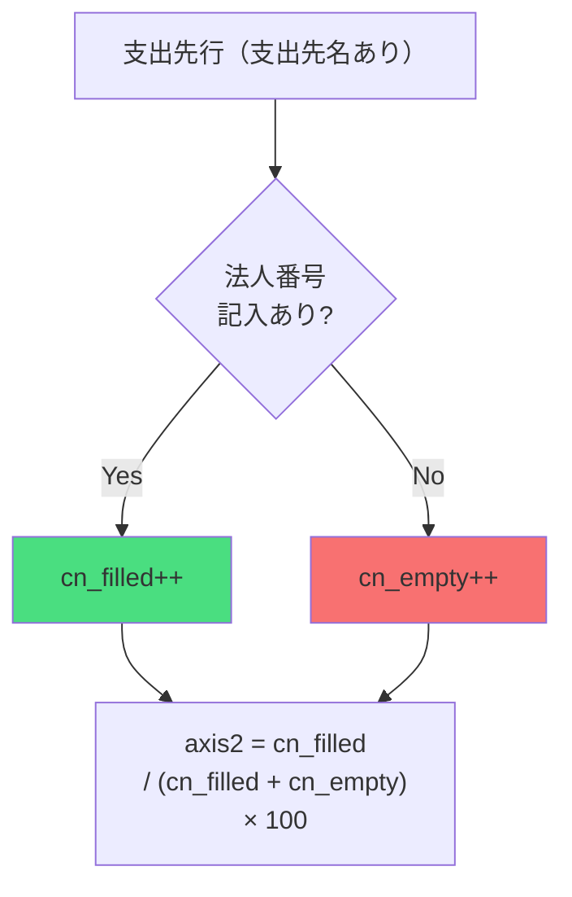

---

## 軸3: 予算・支出バランス（重み20%）

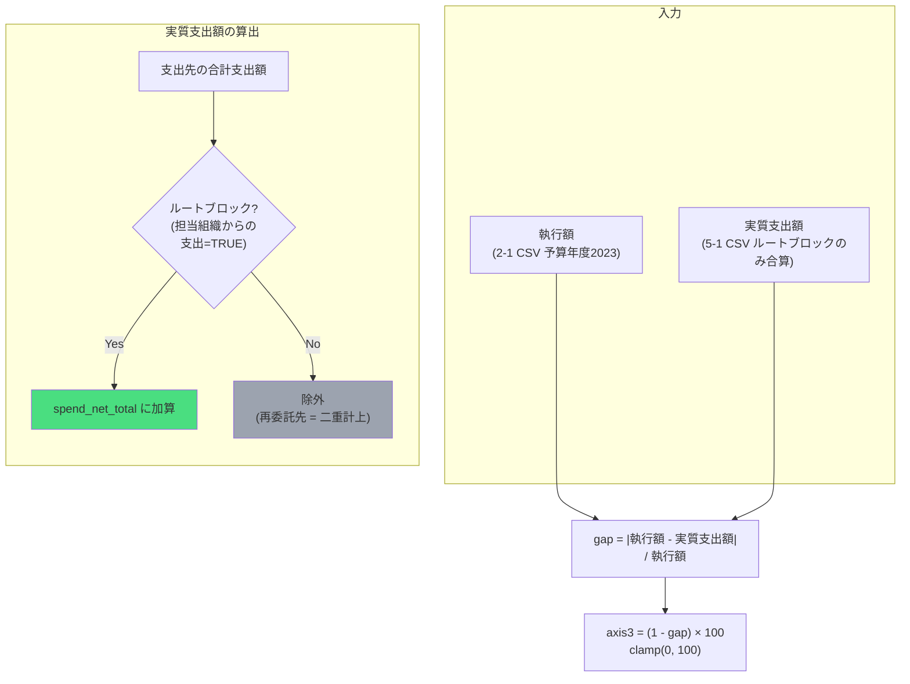

### gap の解釈

| gap | axis3 | 意味 |
|-----|-------|------|
| 0.0 | 100点 | 執行額と実質支出額が完全一致 |
| 0.1 | 90点 | 10%の乖離 |
| 0.5 | 50点 | 50%の乖離 |
| 1.0+ | 0点 | 執行額以上の乖離 |

---

## 軸4: ブロック構造の妥当性（重み10%）

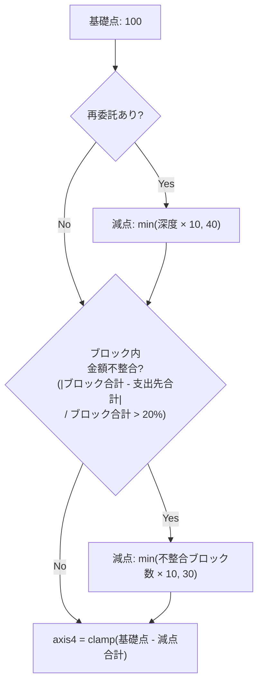

### 再委託深度の算出

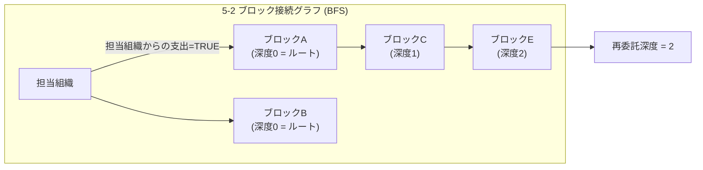

### 減点テーブル

| 再委託深度 | 減点 |
|-----------|------|
| 0 (なし) | 0 |
| 1 | -10 |
| 2 | -20 |
| 3 | -30 |
| 4+ | -40 |

| 金額不整合ブロック数 | 減点 |
|-------------------|------|
| 0 | 0 |
| 1 | -10 |
| 2 | -20 |
| 3+ | -30 |

---

## 軸5: 支出先名の透明性（重み10%）

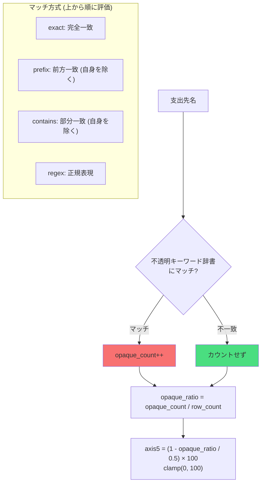

### 不透明キーワード辞書 (13ルール)

| パターン | 方式 | レベル | 説明 |
|---------|------|--------|------|
| `その他` | exact | 1 | 完全不明 |
| `その他の支出先` | exact | 1 | 完全不明 |
| `その他支出先` | exact | 1 | 完全不明 |
| `未定` | exact | 1 | 未確定 |
| `非公開` | exact | 1 | 非公開 |
| `個人` | exact | 2 | 匿名化 |
| `^[A-Za-z]社$` | regex | 2 | A社, B社 等 |
| `^○○` | regex | 3 | プレースホルダー |
| `^××` | regex | 3 | プレースホルダー |
| `^■■` | regex | 3 | プレースホルダー |
| `その他` | prefix | 2 | 「その他○○」集約表記 |
| `未定` | contains | 2 | 未確定を含む |
| `非公開` | contains | 2 | 非公開を含む |

### opaque_ratio の解釈

| opaque_ratio | axis5 | 意味 |
|-------------|-------|------|
| 0% | 100点 | 不透明な支出先名なし |
| 10% | 80点 | 10%が不透明 |
| 25% | 50点 | 25%が不透明 |
| 50%+ | 0点 | 半数以上が不透明 |

---

## 総合スコア

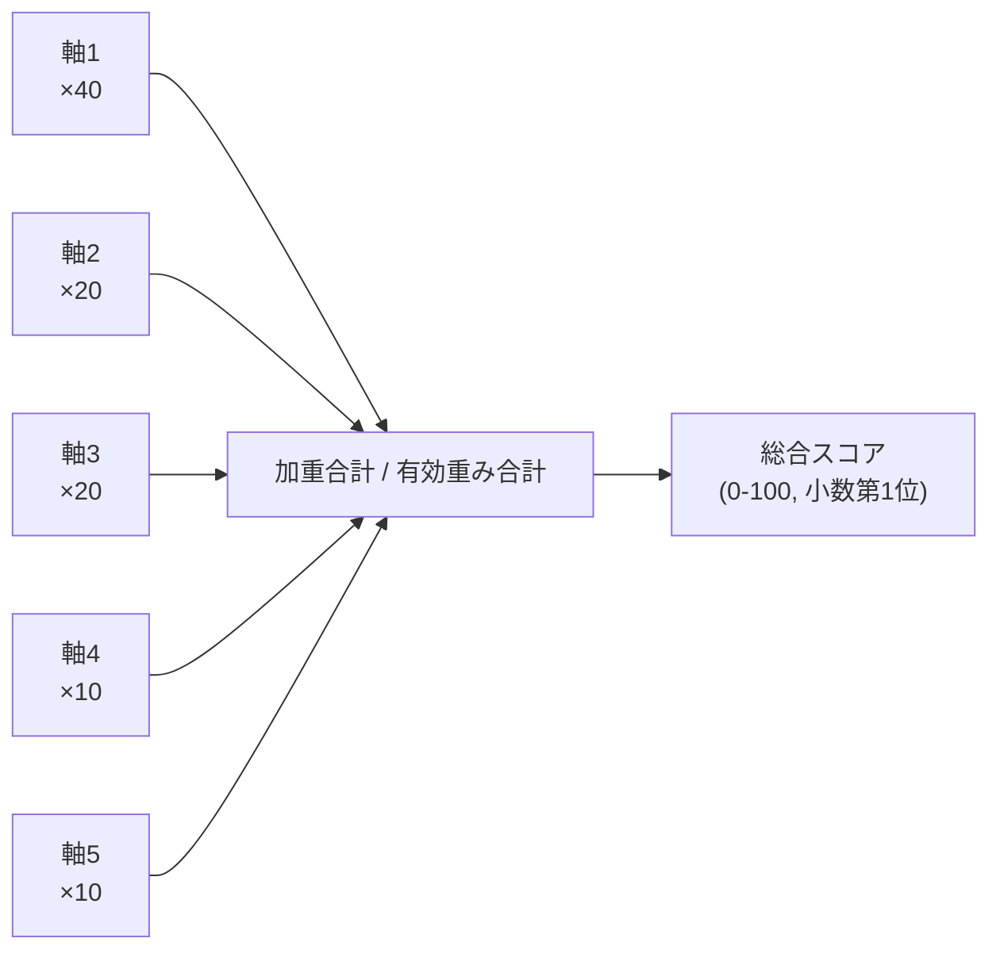

$$
\text{totalScore} = \frac{\sum_{i \in \text{有効軸}} \text{axis}_i \times w_i}{\sum_{i \in \text{有効軸}} w_i}
$$

軸スコアが `None`（データなし）の場合、その軸は除外され残りの重みで再配分される。

### 重み配分の根拠

| 軸 | 重み | 根拠 |
|----|------|------|
| 軸1 支出先名品質 | 40% | 支出先が特定できるかが最も重要な品質指標 |
| 軸2 法人番号記入率 | 20% | 法人番号による追跡可能性 |
| 軸3 予算・支出バランス | 20% | 予算執行の説明責任 |
| 軸4 ブロック構造 | 10% | 再委託の複雑さ（構造的リスク） |
| 軸5 透明性 | 10% | 不透明名称の使用（軸1と補完関係） |

---

## 出力ファイル

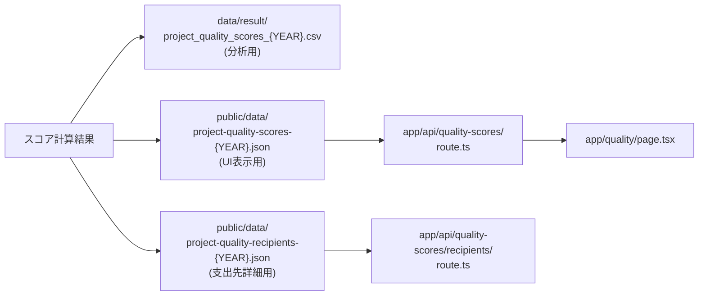
